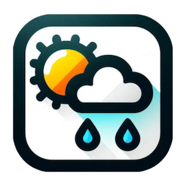
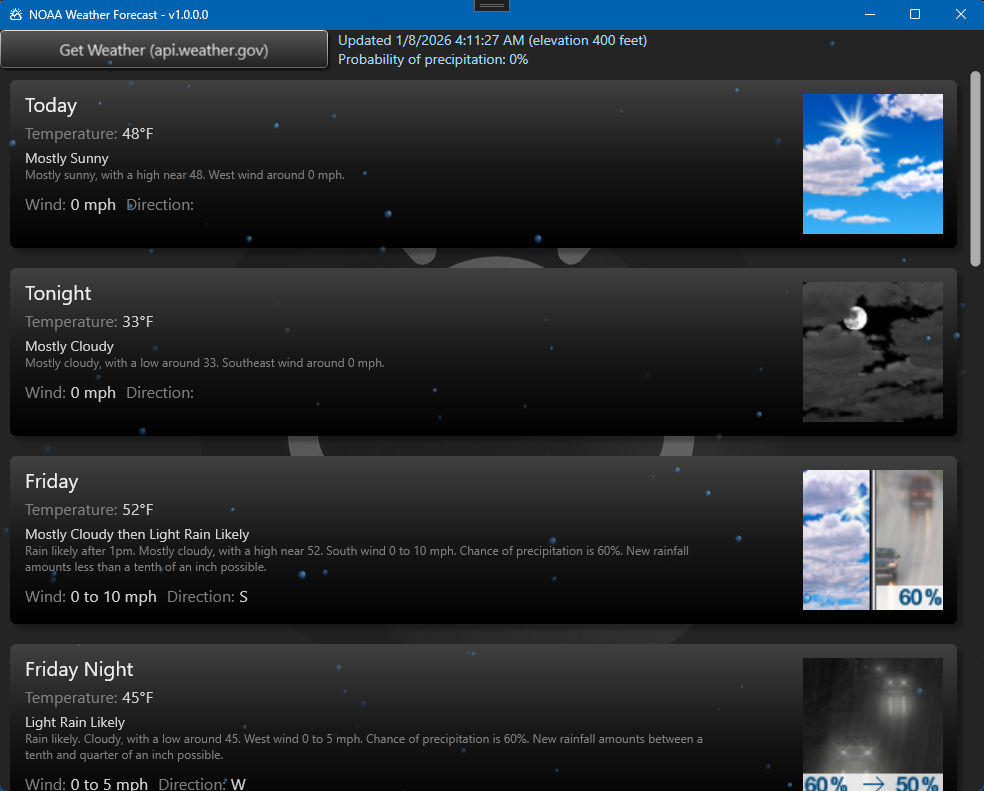
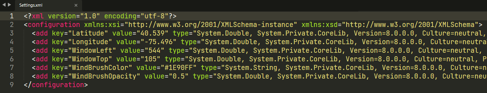



## NOAA Weather Forecast - WPF

## v1.0.0.0 - January, 2026
**Dependencies**

| Assembly | Version |
| ---- | ---- |
| .NETCore | 8.0 |

- A [WPF](https://learn.microsoft.com/en-us/dotnet/desktop/wpf) application that fetches the weekly forecast from the goverment weather [API](https://api.weather.gov).
- The background wind effect is based on the actual wind speed for the current day.
- Enter your latitude/longitude into the `Settings.xml` file for your region.
- This project includes my home-brew `CartesianChart` control, and my [spinner](https://github.com/GuildOfCalamity/SpinnerDemo) control for the background animations.
- Don't forget to give a ⭐ if you find this repo helpful or informative.

